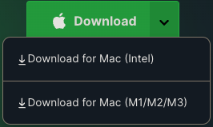

# 410 Game Scripts

## Description

This repository contains the scripts that automate the process of playing games.

Focused skill/package:

- **Python**
- **PyAutoGUI** (GUI automation)
- **Image Processing** (OpenCV, PIL)
- **pytesseract** (OCR)

May find the description of each script in the corresponding folder.

## Environment

### Mac (M1)

- Anaconda installed
  - Verify that Anaconda is installed by typing `conda -V` in your terminal window.
  - If not, download [here](https://www.anaconda.com/download).\
  

Follow this [guide](https://blog.roboflow.com/m1-opencv/) to set up opencv on M1 Mac.
