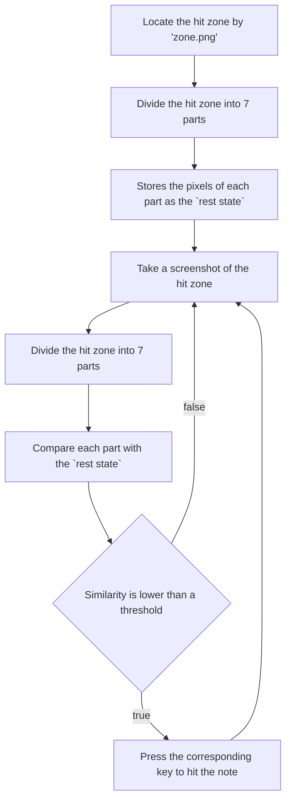

# Auto Script (Rhythm Game)

This project is a bot script for [Bemuse](https://bemuse.ninja/), a rhythm game.

## Environment

### Mac

- Admin's permission:
  - screen record
  - accessibility control of auto mouse click & key press

- Need to allow VS Code for screen record (Require Admin's permission, some students will need to ask parents).

- Need to allow VS Code for accessibility control of auto mouse click & key press (Require Admin's permission).

- Anaconda installed (if not, see [here](../README.md)).

### Mac (Intel)

- Install packages:

  ```bash
  pip install -r requirements.txt
  ```

#### Mac (M1)

- May use `opencv-python`, thus conda environment is recommended.

- To use the spec file to create an identical environment on the same machine or another machine:

   ```bash
   conda create --name myenv --file spec-file.txt
   ```

- To use the spec file to install its listed packages into an existing environment:

   ```bash
   conda install --name myenv --file spec-file.txt
   ```

### Windows

- [ ] TODO

## How to Run

1. Preferably, split the screen with VS Code and [Bemuse](https://bemuse.ninja/).
2. Pick a song but don't start it yet.
3. Take a screenshot of the hit zone (the area where the notes should be hit) and save it as `zone.png` in the same directory as `main.py`.\
   For example:\
   
4. Run `main.py` and follow the instructions on the terminal.

## How it works

1. Before the game starts, the script will locate the hit zone by `zone.png`.
2. Divides the hit zone into 7 parts. These parts will be the zones in rest state.
3. In a `while` loop, the script will take a screenshot of the hit zone and compare it with the rest state.
4. If the similarity of a zone is lower than a threshold, it means there is a note in that zone.
5. The script will then press the corresponding key to hit the note.


